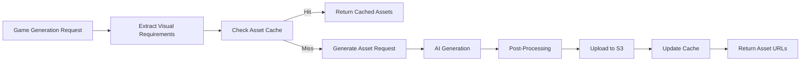

# Asset Generation Service Design

## Overview

The Asset Generation Service will provide AI-generated visual assets for GameVibe AI games, including sprites, backgrounds, UI elements, and effects. This service will integrate with existing game generation flow to create custom visuals that match each game's unique style and requirements.

## Architecture

### Service Structure

```
packages/asset-generator/
├── src/
│   ├── index.ts              # Service entry point
│   ├── generators/           # AI integration modules
│   │   ├── dalle.ts         # OpenAI DALL-E 3 integration
│   │   ├── stable-diffusion.ts  # Stable Diffusion integration
│   │   └── base.ts          # Base generator interface
│   ├── processors/          # Asset processing
│   │   ├── optimizer.ts     # Image optimization
│   │   ├── sprite-sheet.ts  # Sprite sheet generation
│   │   └── formatter.ts     # Format conversion
│   ├── templates/           # Asset templates
│   │   ├── sprites/         # Character/object sprites
│   │   ├── backgrounds/     # Scene backgrounds
│   │   └── ui/             # UI elements
│   ├── storage/            # Storage management
│   │   ├── s3.ts           # S3 upload/download
│   │   └── cache.ts        # Redis caching layer
│   └── types/              # TypeScript types
└── tests/                  # Unit tests

```

## Storage Design

### S3 Structure

```
gamevibe-assets/
├── games/
│   ├── {gameId}/
│   │   ├── sprites/
│   │   │   ├── player.png
│   │   │   ├── enemies/
│   │   │   └── items/
│   │   ├── backgrounds/
│   │   │   ├── main-bg.png
│   │   │   └── layers/
│   │   ├── ui/
│   │   │   ├── buttons/
│   │   │   └── panels/
│   │   └── metadata.json
├── templates/              # Reusable asset templates
│   ├── sprites/
│   ├── backgrounds/
│   └── ui/
└── cache/                 # Frequently used assets
    └── {hash}/
```

### Database Schema

```typescript
// Extend existing Game model
interface GameAssets {
  version: number;
  generatedAt: Date;
  status: 'pending' | 'generating' | 'complete' | 'failed';
  manifest: {
    sprites: AssetEntry[];
    backgrounds: AssetEntry[];
    ui: AssetEntry[];
    effects: AssetEntry[];
  };
  metadata: {
    style: string;
    colorPalette: string[];
    theme: string;
    generator: 'dalle' | 'stable-diffusion';
  };
}

interface AssetEntry {
  id: string;
  type: string;
  url: string;
  thumbnail?: string;
  dimensions: { width: number; height: number };
  format: 'png' | 'webp' | 'svg';
  size: number;
  tags: string[];
}
```

### Caching Strategy

1. **Redis Cache Layers**:
   - **L1 - Hot Assets**: Recently generated assets (TTL: 1 hour)
   - **L2 - Template Cache**: Common templates and base assets (TTL: 24 hours)
   - **L3 - CDN**: CloudFront/Cloudflare for global distribution

2. **Cache Key Structure**:
   ```
   asset:{gameId}:{type}:{assetId}
   template:{type}:{templateId}
   generation:{jobId}
   ```

3. **Cache Warming**:
   - Pre-generate common asset types
   - Cache popular game assets
   - Background generation for templates

## Generation Pipeline

### 1. Asset Request Flow



### 2. Generation Process

1. **Visual Requirement Extraction**:
   ```typescript
   interface VisualRequirements {
     gameType: GameType;
     style: 'pixel-art' | 'cartoon' | 'realistic' | 'abstract';
     colorScheme: 'vibrant' | 'pastel' | 'dark' | 'monochrome';
     theme: string; // "space", "fantasy", "modern", etc.
     sprites: SpriteRequirement[];
     backgrounds: BackgroundRequirement[];
   }
   ```

2. **Prompt Generation**:
   - Template-based prompts for consistency
   - Style-specific modifiers
   - Negative prompts to avoid unwanted elements

3. **Batch Processing**:
   - Group similar assets for efficiency
   - Parallel generation when possible
   - Priority queue for critical assets

### 3. Optimization Pipeline

1. **Image Processing**:
   - Resize to game-appropriate dimensions
   - Convert to WebP for web delivery
   - Generate multiple resolutions (1x, 2x)
   - Create sprite sheets for animations

2. **File Optimization**:
   - PNG compression with pngquant
   - WebP quality optimization
   - SVG optimization for UI elements

3. **Delivery Optimization**:
   - Generate responsive image sets
   - Create loading placeholders
   - Implement progressive loading

## API Design

### Asset Generator Service API

```typescript
class AssetGeneratorService {
  // Generate assets for a game
  async generateGameAssets(
    gameId: string,
    requirements: VisualRequirements
  ): Promise<GameAssets>;

  // Generate a single asset
  async generateAsset(
    type: AssetType,
    prompt: string,
    options: GenerationOptions
  ): Promise<AssetEntry>;

  // Get asset status
  async getGenerationStatus(jobId: string): Promise<GenerationStatus>;

  // Regenerate specific assets
  async regenerateAssets(
    gameId: string,
    assetIds: string[]
  ): Promise<GameAssets>;
}
```

### Integration with Game Generator

```typescript
// In GameGeneratorService
async generateGame(request: GameGenerationRequest) {
  // 1. Generate game spec
  const gameSpec = await this.ai.analyzeGameRequest(request);
  
  // 2. Extract visual requirements
  const visualReqs = this.extractVisualRequirements(gameSpec);
  
  // 3. Start asset generation (async)
  const assetJob = this.assetGenerator.generateGameAssets(
    gameId,
    visualReqs
  );
  
  // 4. Generate game code with placeholder assets
  const gameCode = await this.generateGameCode(gameSpec);
  
  // 5. Wait for critical assets
  const assets = await assetJob;
  
  // 6. Update code with actual asset URLs
  const finalCode = this.injectAssetUrls(gameCode, assets);
  
  return { gameSpec, code: finalCode, assets };
}
```

## Cost Management

### Generation Limits

1. **Per User Limits**:
   - Free tier: 10 asset generations per month
   - Premium: 100 asset generations per month
   - Custom assets per game: 5-10 depending on type

2. **Optimization Strategies**:
   - Reuse templates when possible
   - Cache and share common assets
   - Batch similar requests
   - Use lower resolution for thumbnails

### Cost Tracking

```typescript
interface AssetGenerationCost {
  gameId: string;
  userId: string;
  timestamp: Date;
  provider: 'dalle' | 'stable-diffusion';
  credits: number;
  dollarCost: number;
  assetCount: number;
}
```

## Implementation Phases

### Phase 1: Core Infrastructure (Week 1)
- [ ] Create asset-generator package
- [ ] Implement S3 storage integration
- [ ] Set up Redis caching layer
- [ ] Create base generator interface

### Phase 2: AI Integration (Week 2)
- [ ] Integrate DALL-E 3 API
- [ ] Add Stable Diffusion fallback
- [ ] Implement prompt templates
- [ ] Create asset post-processing

### Phase 3: Game Integration (Week 3)
- [ ] Update game generation flow
- [ ] Modify game templates for dynamic assets
- [ ] Implement asset injection
- [ ] Add loading states

### Phase 4: Optimization & Polish (Week 4)
- [ ] Implement sprite sheet generation
- [ ] Add progressive loading
- [ ] Create asset management UI
- [ ] Performance optimization

## Security Considerations

1. **Content Filtering**:
   - Pre-filter prompts for inappropriate content
   - Post-generation content moderation
   - Blocklist for prohibited terms

2. **Access Control**:
   - Signed S3 URLs with expiration
   - Rate limiting per user
   - API key rotation

3. **Data Privacy**:
   - User assets isolated by gameId
   - Automatic cleanup of old assets
   - GDPR compliance for data deletion

## Monitoring & Analytics

1. **Metrics to Track**:
   - Generation success rate
   - Average generation time
   - Cache hit rate
   - Storage usage
   - Cost per game

2. **Alerts**:
   - High failure rate
   - Excessive API costs
   - Storage quota warnings
   - Performance degradation

## Future Enhancements

1. **Advanced Features**:
   - Animated sprite generation
   - 3D asset support
   - Custom style training
   - Asset variations

2. **User Features**:
   - Asset library browser
   - Custom asset uploads
   - Asset remix/editing
   - Community asset sharing