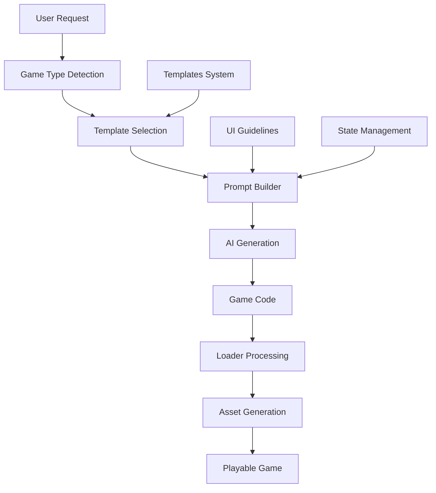
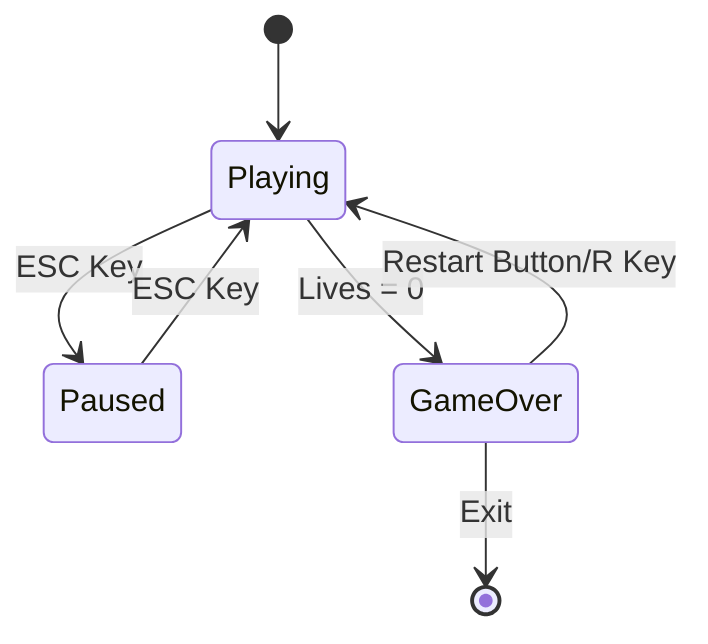

# Enhanced Template System Documentation

## Overview

The Enhanced Template System is a comprehensive solution for generating high-quality, fully-functional browser games through AI. It addresses common issues with AI-generated games including missing restart functionality, poor UI layout, and generic placeholder assets.

## Table of Contents

- [Problem Statement](#problem-statement)
- [System Architecture](#system-architecture)
- [Core Components](#core-components)
  - [1. Templates System](#1-templates-system)
  - [2. Game Prompt Builder](#2-game-prompt-builder)
  - [3. Enhanced Loader](#3-enhanced-loader)
- [Implementation Details](#implementation-details)
- [Usage Guide](#usage-guide)
- [Benefits](#benefits)
- [Testing](#testing)
- [Future Enhancements](#future-enhancements)

## Problem Statement

Before the Enhanced Template System, AI-generated games suffered from several critical issues:

1. **No Restart Functionality**: Games didn't reset properly when players died
2. **Poor UI Layout**: Inconsistent text positioning and styling
3. **Generic Assets**: All games used the same placeholder graphics regardless of type
4. **Missing State Management**: No proper game over, pause, or restart flows
5. **Incomplete Games**: AI often skipped essential game functions

## System Architecture



## Core Components

### 1. Templates System

**Location**: `packages/ai-service/src/prompts/templates.ts`

#### Standardized Game Template

The core template enforces a consistent structure for all games:

```javascript
// Global variables
[GLOBAL_VARIABLES]

// Game state management
var gameState = {
    isGameOver: false,
    isPaused: false,
    score: 0,
    lives: 3,
    level: 1,
    highScore: 0
};

// Initial positions for reset
var initialPositions = {};

// Mandatory functions
function resetGameState() { }
function storeInitialPositions() { }
function resetGameObjects() { }
function gameOver() { }
function restartGame() { }
function pauseGame() { }
```

#### Game-Type-Specific Templates

Each game type has customized sections:

**Shooter Games**:
- Player respawn at original position
- Bullet and enemy clearing on restart
- Explosion effects and power-ups
- Lives system with proper game over

**Platformer Games**:
- Player position reset
- Coin and collectible regeneration
- Enemy patrol route reset
- Fall detection and instant respawn

**Puzzle Games**:
- Grid state reset
- Move counter reset
- Combo tracking
- Match effects and animations

#### UI Layout Guidelines

Consistent positioning rules:
- **Score**: Top-left (20, 20)
- **Lives**: Top-right (780, 20)
- **Title**: Top center (400, 30)
- **Game Over**: Centered (400, 300)
- **UI Depth**: 100+ for proper layering

### 2. Game Prompt Builder

**Location**: `packages/ai-service/src/prompts/game-prompt-builder.ts`

The enhanced prompt builder:

1. **Detects Game Type**: Analyzes the game description
2. **Selects Templates**: Chooses appropriate game-type templates
3. **Injects Requirements**: Adds mandatory implementation rules
4. **Enforces Structure**: Ensures all required functions are included

Example enhancement:
```typescript
// Get game-type-specific templates
const gameType = spec.type.toLowerCase().replace('-', '');
const typeTemplates = GAME_TYPE_TEMPLATES[gameType] || GAME_TYPE_TEMPLATES.shooter;

// Build enhanced template with pre-filled sections
const enhancedTemplate = STANDARDIZED_GAME_TEMPLATE
  .replace('[GLOBAL_VARIABLES]', typeTemplates.globalVariables)
  .replace('[STORE_POSITIONS]', typeTemplates.storePositions)
  .replace('[RESET_OBJECTS]', typeTemplates.resetObjects)
  .replace('[GAME_OVER_SCREEN]', typeTemplates.gameOverScreen)
  .replace('[UPDATE_UI]', typeTemplates.updateUI)
  .replace('[PAUSE_SCREEN]', DEFAULT_UI_TEMPLATES.pauseScreen);
```

### 3. Enhanced Loader

**Location**: `packages/web-runtime/src/game/loader.ts`

#### Game Type Detection

The loader analyzes game code to determine type:
```typescript
let gameType = 'generic';
const codeStr = gameCode.toLowerCase();
if (codeStr.includes('shoot') || codeStr.includes('bullet') || codeStr.includes('laser')) {
  gameType = 'shooter';
} else if (codeStr.includes('platform') || codeStr.includes('jump') || codeStr.includes('coin')) {
  gameType = 'platformer';
} else if (codeStr.includes('puzzle') || codeStr.includes('gem') || codeStr.includes('match')) {
  gameType = 'puzzle';
}
```

#### Dynamic Asset Generation

Game-type-specific placeholder assets:

**Shooter Assets**:
- Space-themed gradient backgrounds
- Animated spaceships with engine glow
- Pulsing enemy sprites
- Explosion particle effects
- Star-shaped power-ups

**Platformer Assets**:
- Sky gradient backgrounds
- Textured ground and platforms
- Animated character sprites
- Rotating coins
- Spike hazards

**Puzzle Assets**:
- Grid-pattern backgrounds
- Gem shapes with shine effects
- Match burst animations
- Particle effects

## Implementation Details

### State Management Flow



### Asset Generation Process

1. **Detect Game Type**: Analyze code keywords
2. **Select Asset Set**: Choose appropriate textures and sprites
3. **Generate Graphics**: Create using Phaser's graphics API
4. **Add Animations**: Multi-frame sprites for movement
5. **Apply Effects**: Gradients, patterns, and particle effects

### Global Variable Injection

To prevent reference errors, the loader injects:
```javascript
(window as any).gameOverContainer = null;
(window as any).pauseContainer = null;
(window as any).scoreText = null;
(window as any).livesText = null;
```

## Usage Guide

### For Developers

1. **Adding New Game Types**:
```typescript
// In templates.ts
export const GAME_TYPE_TEMPLATES = {
  racing: {
    globalVariables: `var car, track, opponents, lapTime;`,
    storePositions: `initialPositions.carX = 400;`,
    resetObjects: `// Reset car position and lap time`,
    gameOverScreen: `// Racing-specific game over`,
    updateUI: `// Update lap time and position`
  }
};
```

2. **Customizing UI Layout**:
```typescript
// In templates.ts
export const UI_LAYOUT_GUIDELINES = `
// Add new positioning rules
- Timer: Top center (400, 60)
- Minimap: Top-right corner (700, 100)
`;
```

### For Users

Simply use natural language game descriptions:
```
/create-game space shooter with boss battles
/create-game platformer with wall jumping
/create-game match-3 puzzle with power gems
```

## Benefits

### 1. Consistency
- All games follow the same structural pattern
- Predictable function names and organization
- Standardized state management

### 2. Completeness
- Mandatory functions ensure full functionality
- No missing restart or game over logic
- Proper cleanup and reset mechanisms

### 3. Visual Quality
- Game-appropriate placeholder assets
- Consistent UI styling with strokes
- Proper depth layering

### 4. User Experience
- Immediate playability
- Intuitive controls (ESC, R)
- Clear visual feedback

### 5. Developer Experience
- Easy to extend with new game types
- Clear separation of concerns
- Well-documented patterns

## Testing

### Unit Tests
```typescript
describe('Enhanced Template System', () => {
  it('should select correct template for game type', () => {
    const gameType = detectGameType('space shooter game');
    expect(gameType).toBe('shooter');
  });

  it('should generate appropriate assets', () => {
    const assets = generateAssetsForType('platformer');
    expect(assets).toContainEqual(
      expect.objectContaining({ key: 'coin' })
    );
  });
});
```

### Integration Tests
1. Generate games of each type
2. Verify restart functionality works
3. Check UI element positioning
4. Validate asset loading

### Manual Testing Queries
```bash
# Test shooter restart
/create-game space shooter where player has 3 lives

# Test platformer coin reset
/create-game platformer with collectible gems

# Test puzzle grid reset
/create-game match-3 puzzle game
```

## Future Enhancements

### 1. Advanced Asset System
- Support for custom asset packs
- Asset theme variations (retro, modern, cartoon)
- Procedural texture generation

### 2. Extended Game Types
- Racing games with track generation
- Strategy games with grid layouts
- Card games with deck management

### 3. Multiplayer Support
- Synchronized state management
- Player spawn points
- Networked UI elements

### 4. Accessibility Features
- High contrast mode templates
- Colorblind-friendly palettes
- Screen reader support

### 5. Performance Optimizations
- Asset caching between games
- Lazy loading for large games
- WebGL optimization hints

## Conclusion

The Enhanced Template System represents a significant improvement in AI-generated game quality. By enforcing structure, providing game-specific assets, and ensuring complete functionality, it delivers games that are not just technically correct but genuinely playable and enjoyable.

The system's modular design makes it easy to extend and maintain, while its comprehensive approach ensures that every generated game meets a high standard of quality and completeness.