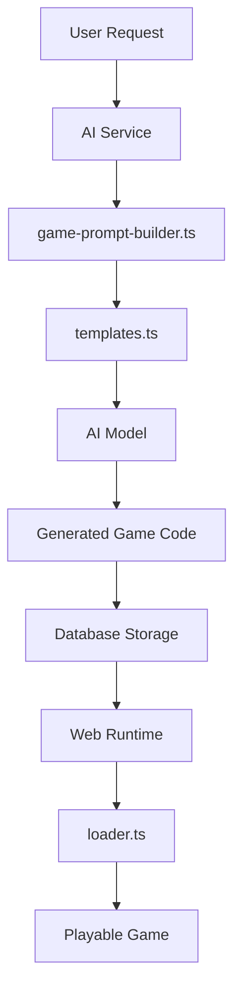
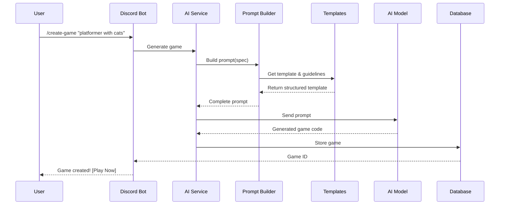
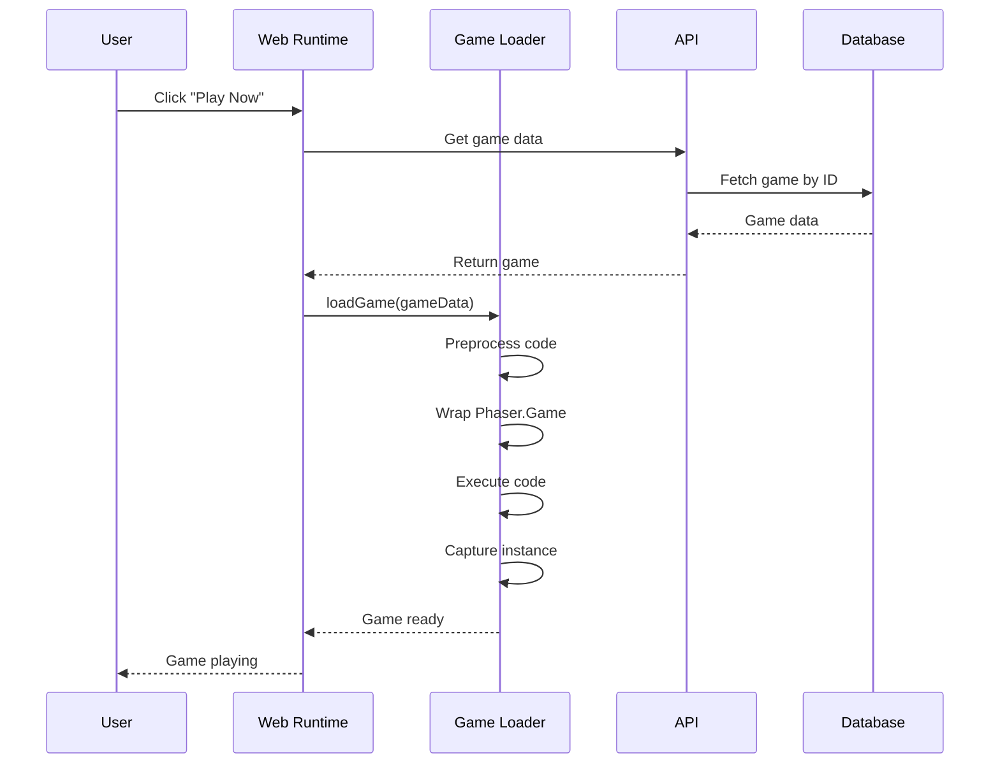

# Game Loading Architecture Documentation

## Overview

This document provides comprehensive documentation for the game loading and generation architecture in GameVibe AI, covering three critical components:

1. **loader.ts** - Dynamic game loader in the web runtime
2. **game-prompt-builder.ts** - AI prompt construction for game generation
3. **templates.ts** - Game templates and structural guidelines

## Table of Contents

- [Architecture Overview](#architecture-overview)
- [Component Details](#component-details)
  - [1. Game Loader (loader.ts)](#1-game-loader-loaderts)
  - [2. Game Prompt Builder](#2-game-prompt-builder)
  - [3. Templates System](#3-templates-system)
- [Integration Flow](#integration-flow)
- [Best Practices](#best-practices)
- [Troubleshooting](#troubleshooting)
- [Future Improvements](#future-improvements)

## Architecture Overview



The game generation and loading system follows this flow:
1. User requests a game through Discord
2. AI service builds a structured prompt using templates
3. AI generates game code following strict guidelines
4. Generated code is stored in the database
5. Web runtime loads and executes the game dynamically
6. Loader handles compatibility and error recovery

## Component Details

### 1. Game Loader (loader.ts)

**Location**: `packages/web-runtime/src/game/loader.ts`

**Purpose**: Dynamically loads and executes AI-generated Phaser games in the browser, handling compatibility issues and providing error recovery.

#### Key Classes and Methods

##### GameLoader Class

```typescript
export class GameLoader extends EventEmitter {
  private currentGame: GameInstance | null = null;
  private container: HTMLElement;
  private apiClient: APIClient;
  private multiplayerManager: MultiplayerManager | null = null;

  constructor(apiClient: APIClient)
  async loadGame(gameData: Game, multiplayerManager?: MultiplayerManager): Promise<void>
  private executeGameCode(gameCode: string): Promise<any>
  unloadGame(): void
  // ... other methods
}
```

#### Core Functionality

##### 1. Game Code Preprocessing

The loader performs several preprocessing steps on the game code:

```typescript
// Extract JavaScript from HTML if necessary
if (gameCode.includes('<!DOCTYPE html>') || gameCode.includes('<html>')) {
  // Extracts JavaScript from <script> tags
  const scriptMatches = [...gameCode.matchAll(/<script[^>]*>([\s\S]*?)<\/script>/gi)];
  // Uses the last script tag content
}

// Inject parent container if missing
if (!gameCode.includes("parent:") && !gameCode.includes("parent :")) {
  gameCode = gameCode.replace(
    /var\s+config\s*=\s*{/,
    `var config = {\n    parent: 'game-container',`
  );
}

// Remove markdown code blocks if present
gameCode = gameCode.replace(/```javascript[\s\S]*?\n/g, '');
gameCode = gameCode.replace(/```js[\s\S]*?\n/g, '');
gameCode = gameCode.replace(/```\n/g, '');
gameCode = gameCode.replace(/\n```/g, '');
```

##### 2. Physics Group Compatibility Layer

One of the most critical features is the physics group compatibility wrapper:

```typescript
config.scene.create = function() {
  const scene = this;
  if (scene.physics && scene.physics.add && scene.physics.add.group) {
    const originalGroup = scene.physics.add.group.bind(scene.physics.add);
    
    scene.physics.add.group = function(config?: any) {
      const group = originalGroup(config);
      
      // Ensure countActive method exists
      if (!group.countActive) {
        group.countActive = function(value = true) {
          // Modern Phaser uses getChildren()
          if (this.getChildren) {
            const children = this.getChildren();
            return children.filter((child: any) => child && child.active === value).length;
          }
          // Older Phaser uses children.entries
          else if (this.children && this.children.entries) {
            return this.children.entries.filter((child: any) => child && child.active === value).length;
          }
          return 0;
        };
      }
      
      // Ensure children structure exists for compatibility
      if (!group.children && group.getChildren) {
        group.children = {
          entries: group.getChildren(),
          iterate: function(callback: any) {
            group.getChildren().forEach(callback);
          }
        };
      }
      
      return group;
    };
  }
}
```

##### 3. Asset Placeholder Generation

The loader generates placeholder assets to ensure games are immediately playable:

```typescript
// Create placeholder graphics
const graphics = this.make.graphics({ add: false });

// Generate common textures
const textures = [
  { key: 'sky', width: 800, height: 600, color: 0x87CEEB },
  { key: 'ground', width: 400, height: 50, color: 0x8B4513 },
  { key: 'platform', width: 400, height: 50, color: 0x8B4513 },
  { key: 'fish', width: 32, height: 32, color: 0xFFD700, circle: true },
  { key: 'coin', width: 32, height: 32, color: 0xFFD700, circle: true },
];

// Create sprite sheets with animation frames
const spritesheets = [
  { key: 'cat', frameWidth: 32, frameHeight: 32, frames: 9, color: 0xFF6600 },
  { key: 'player', frameWidth: 32, frameHeight: 32, frames: 9, color: 0xFF6600 }
];
```

##### 4. Game Execution and Capture

The loader uses a clever technique to capture Phaser game instances:

```typescript
private async executeGameCode(gameCode: string): Promise<any> {
  return new Promise((resolve) => {
    let capturedGame: any = null;
    
    // Store original Phaser.Game
    const OriginalPhaserGame = (window as any).Phaser.Game;
    
    // Override Phaser.Game to capture instances
    (window as any).Phaser.Game = function(config: any) {
      // Wrap scene methods for compatibility
      // ... wrapping logic ...
      
      const instance = new OriginalPhaserGame(config);
      capturedGame = instance;
      return instance;
    };
    
    // Execute the game code
    const executeCode = new Function('Phaser', 'window', `
      var game;
      ${processedCode}
      
      // Try to find and return the game instance
      if (typeof game !== 'undefined' && game) {
        return game;
      }
      if (window.game) {
        return window.game;
      }
      if (Phaser.GAMES && Phaser.GAMES.length > 0) {
        return Phaser.GAMES[0];
      }
      return null;
    `);
    
    // Execute and capture result
    const result = executeCode(Phaser, window);
    
    // Restore original Phaser.Game
    (window as any).Phaser.Game = OriginalPhaserGame;
    
    resolve(result || capturedGame);
  });
}
```

#### Error Handling

The loader includes comprehensive error handling:

1. **Preprocessing Errors**: Safely handles malformed HTML/JavaScript
2. **Execution Errors**: Catches and reports game code execution failures
3. **Missing Dependencies**: Provides fallbacks for missing methods/properties
4. **Asset Loading Failures**: Uses placeholder assets instead of failing

#### Events

The GameLoader emits several events:

- `gameLoaded`: When a game successfully loads
- `gameError`: When a loading error occurs
- `gameReady`: When the Phaser game is ready
- `gameDestroyed`: When a game is unloaded
- `layoutChanged`: When Discord layout changes

### 2. Game Prompt Builder

**Location**: `packages/ai-service/src/prompts/game-prompt-builder.ts`

**Purpose**: Constructs structured prompts for AI models to generate consistent, high-quality game code.

#### Core Class

```typescript
export class GamePromptBuilder {
  buildGameGenerationPrompt(spec: GameSpec, template: GameTemplate & { assets?: Record<string, string> }): string
  buildAnalysisPrompt(description: string, context?: any): string
}
```

#### Prompt Structure

##### Game Generation Prompt

The prompt builder creates a comprehensive prompt with multiple sections:

1. **System Context**: Establishes the AI's role and expertise
2. **Structural Guidelines**: Enforces consistent code structure
3. **Game Requirements**: Specific details about the requested game
4. **Template Structure**: The exact code template to follow
5. **Assets Information**: Available pre-generated assets
6. **Important Rules**: Quality and implementation guidelines
7. **Code Requirements**: Technical standards
8. **Restrictions**: What NOT to do

Example prompt structure:

```typescript
`You are an expert game developer specializing in creating fun, engaging browser games using Phaser.js.

${GAME_STRUCTURE_GUIDELINES}

Your task is to generate a complete, playable game based on the following requirements:

## Game Requirements:
- **Type**: ${spec.type}
- **Name**: ${spec.name}
- **Description**: ${spec.originalDescription}
- **Player Count**: ${spec.playerCount}
- **Core Mechanics**: ${spec.coreMechanics.join(', ')}
- **Key Features**: ${spec.features.join(', ')}
${spec.difficulty ? `- **Difficulty**: ${spec.difficulty}` : ''}

## Template Structure:
You MUST use this EXACT template structure and fill in the placeholders:
\`\`\`javascript
${STANDARDIZED_GAME_TEMPLATE}
\`\`\`

Replace the placeholders with actual code following the structure guidelines above.

## Template Sections Available:
${Object.entries(template.sections).map(([key, value]) => `### ${key}:\n${value}`).join('\n\n')}

${hasAssets ? `## Available Assets:
You have the following professionally generated assets available. Use these EXACT asset keys and URLs in your game:

${Object.entries(template.assets!).map(([key, url]) => `- ${key}: "${url}"`).join('\n')}

**IMPORTANT**: You MUST use these provided asset URLs instead of placeholder data URIs or shapes. Update the ASSET_LOADING section to load these assets properly.
` : ''}

## Important Rules:
1. The game MUST be immediately playable - no placeholder functionality
2. Use proper Phaser.js APIs and best practices
3. Include collision detection and physics where appropriate
4. Add visual feedback (particles, tweens, etc.) for good game feel
5. Implement score tracking and win/lose conditions
6. Balance difficulty appropriately - easy to learn, satisfying to master
7. Add sound effects placeholders (even if just console.logs for now)
8. Make the game FUN and engaging
9. Include clear visual indicators for game state
10. Add smooth animations and transitions

## Code Requirements:
- Use ES6+ JavaScript syntax
- Keep code clean and well-organized
- Add helpful comments for complex logic
- Use meaningful variable names
- Implement proper game state management
- Handle edge cases gracefully

## DO NOT:
${hasAssets ? '- Use placeholder assets - use ONLY the provided asset URLs above' : '- Include external asset URLs (use data URIs or simple shapes)'}
- Add complex networking code
- Create overly complicated mechanics
- Include any placeholder or "TODO" comments
- Generate incomplete features

Generate ONLY the complete game code. Do not include explanations, markdown formatting, or any text outside the JavaScript code.

Remember: This game will be played by real users, so make it polished and enjoyable!`
```

##### Analysis Prompt

Used to extract structured information from user descriptions:

```typescript
buildAnalysisPrompt(description: string, context?: any): string {
  return `Analyze this game request and extract structured information to guide game generation.

## Game Description:
"${description}"

${context ? `## Additional Context:
- Server Name: ${context.serverName || 'Unknown'}
- Member Count: ${context.memberCount || 'Unknown'}
` : ''}

## Your Task:
Analyze the description and determine:

1. **Game Type**: Choose the most appropriate type from: platformer, puzzle, rpg, shooter, endless-runner, tower-defense, other
2. **Core Mechanics**: List 3-5 core gameplay mechanics
3. **Player Count**: Determine if it's single-player, 2-player, or multiplayer
4. **Key Features**: List 3-5 key features that should be included
5. **Suggested Name**: Create a catchy, appropriate game name
6. **Difficulty**: Suggest difficulty level (easy, medium, hard)
7. **Visual Style**: Brief description of the visual theme
8. **Unique Elements**: Any special or unique features mentioned

## Output Format:
Return a JSON object with this structure:
{
  "type": "game_type",
  "name": "Suggested Game Name",
  "description": "Enhanced 1-2 sentence description",
  "coreMechanics": ["mechanic1", "mechanic2", "mechanic3"],
  "features": ["feature1", "feature2", "feature3"],
  "playerCount": "1",
  "difficulty": "medium",
  "visualStyle": "description of visual theme",
  "uniqueElements": ["element1", "element2"]
}`;
}
```

### 3. Templates System

**Location**: `packages/ai-service/src/prompts/templates.ts`

**Purpose**: Provides standardized templates and guidelines for consistent game generation.

#### Template Components

##### 1. System Prompts

```typescript
export const SYSTEM_PROMPTS = {
  gameGeneration: `You are an expert game developer with deep knowledge of Phaser.js and game design principles. You create fun, engaging, and polished games that are immediately playable. You focus on good game feel, balanced difficulty, and enjoyable mechanics.`,
  
  codeGeneration: `You are a skilled JavaScript developer specializing in Phaser.js game development. You write clean, efficient, and well-structured code following best practices. You ensure all code is complete, functional, and free of placeholders.`,
  
  analysis: `You are a game design analyst who can extract key information from game descriptions and provide structured analysis for game development. You understand player intent and can suggest appropriate game mechanics and features.`
};
```

##### 2. Standardized Game Template

The core template that ensures consistent structure:

```javascript
export const STANDARDIZED_GAME_TEMPLATE = `
// [GAME_NAME] - Phaser 3 Game

var config = {
    parent: 'game-container',
    type: Phaser.AUTO,
    width: 800,
    height: 600,
    physics: {
        default: 'arcade',
        arcade: {
            gravity: { y: [GRAVITY_Y] },
            debug: false
        }
    },
    scene: {
        preload: preload,
        create: create,
        update: update
    }
};

var game = new Phaser.Game(config);

// Global variables
[GLOBAL_VARIABLES]

function preload() {
    // Load assets
    [ASSET_LOADING]
}

function create() {
    // Setup world
    [WORLD_SETUP]
    
    // Create game objects
    [GAME_OBJECTS]
    
    // Setup physics and collisions
    [PHYSICS_SETUP]
    
    // Create UI
    [UI_SETUP]
    
    // Initialize game state
    [GAME_STATE_INIT]
}

function update() {
    // Handle input
    [INPUT_HANDLING]
    
    // Update game logic
    [GAME_LOGIC]
    
    // Check win/lose conditions
    [WIN_LOSE_CHECK]
}

// Helper functions
[HELPER_FUNCTIONS]
`;
```

##### 3. Game Structure Guidelines

Critical rules that ensure generated games work properly:

```javascript
export const GAME_STRUCTURE_GUIDELINES = `
IMPORTANT STRUCTURAL RULES FOR GAME GENERATION:

1. ALWAYS use the standard template structure with these exact sections:
   - var config = { ... }
   - var game = new Phaser.Game(config);
   - function preload() { ... }
   - function create() { ... }
   - function update() { ... }

2. PHYSICS GROUP CREATION:
   - Always use: this.physics.add.group() for dynamic groups
   - Always use: this.physics.add.staticGroup() for static groups
   - Groups will automatically have countActive() and children.iterate() methods

3. GLOBAL VARIABLES:
   - Declare all game objects as global variables BEFORE the functions
   - Example: var player, enemies, score = 0, scoreText;

4. ASSET LOADING:
   - Use simple asset keys without paths
   - Example: this.load.image('player', 'assets/player.png');

5. PHYSICS COLLISIONS:
   - Always set up collisions in create() after creating objects
   - Example: this.physics.add.collider(player, platforms);

6. GAME STATE:
   - Track game state with clear variables (gameOver, isPaused, level)
   - Initialize all state variables in create()

7. ERROR PREVENTION:
   - Always check if objects exist before using them
   - Always bind 'this' context for callbacks
   - Use arrow functions or .bind(this) for event handlers

8. DO NOT:
   - Use class-based scenes (use function-based approach)
   - Create nested functions inside create/update
   - Use async/await or promises
   - Reference undefined variables
`;
```

##### 4. Game Examples

Pre-built examples for different game types:

```javascript
export const GAME_EXAMPLES = {
  platformer: `// Example platformer structure...`,
  puzzle: `// Example puzzle game structure...`,
  shooter: `// Example shooter structure...`
};
```

## Integration Flow

### 1. Game Generation Flow



### 2. Game Loading Flow



## Best Practices

### 1. For AI Game Generation

1. **Always use the standardized template** - This ensures consistent structure
2. **Follow the guidelines strictly** - The AI should adhere to all structural rules
3. **Test with various game types** - Ensure templates work for all game genres
4. **Keep templates updated** - As Phaser evolves, update compatibility layers

### 2. For Game Loading

1. **Defensive programming** - Always check for existence before using properties
2. **Graceful degradation** - Provide fallbacks for missing features
3. **Performance optimization** - Cache processed games when possible
4. **Error recovery** - Allow games to continue even with minor errors

### 3. For Template Design

1. **Clear placeholders** - Use descriptive placeholder names
2. **Modular sections** - Keep template sections independent
3. **Comprehensive guidelines** - Cover all common pitfalls
4. **Version compatibility** - Support multiple Phaser versions

## Troubleshooting

### Common Issues and Solutions

#### 1. Physics Group Errors

**Problem**: `countActive is not a function` or `children.iterate is not a function`

**Solution**: The loader automatically adds these methods, but ensure:
- Physics groups are created with `this.physics.add.group()`
- Not using custom group implementations
- Not overriding group methods after creation

#### 2. Asset Loading Failures

**Problem**: Games show missing textures or sprites

**Solution**: 
- The loader generates placeholder assets automatically
- Check that asset keys match between preload and create
- Ensure assets are loaded before use

#### 3. Game Code Syntax Errors

**Problem**: `Unexpected token` or syntax errors

**Solution**:
- Check for unescaped quotes in strings
- Ensure proper function closures
- Validate JSON structures in game metadata

#### 4. Scene Loading Issues

**Problem**: Game doesn't start or shows black screen

**Solution**:
- Verify config.parent matches container ID
- Check that all required functions exist (preload, create, update)
- Ensure Phaser.Game is instantiated

### Debugging Tools

1. **Console Logging**: The loader includes extensive logging
2. **Source Maps**: Enable source maps for better error tracking
3. **Phaser Debug Mode**: Set `debug: true` in physics config
4. **Network Tab**: Check asset loading in browser DevTools

## Future Improvements

### 1. Enhanced Template System ✅ (IMPLEMENTED)

**Status**: Completed - See [Enhanced Template System Documentation](./enhanced-template-system.md)

The Enhanced Template System has been fully implemented with:
- **Game-Type-Specific Templates**: Automatic template selection based on game type
- **Mandatory State Management**: Enforced restart, pause, and game over functionality
- **Dynamic Asset Generation**: Game-appropriate placeholder graphics
- **UI Consistency**: Standardized layout and styling guidelines
- **Complete Implementation**: All originally planned features are now active

Key improvements delivered:
- Players properly respawn at initial positions
- UI elements are consistently positioned and styled
- Game-type-specific assets enhance visual quality
- Full game lifecycle management (pause, restart, game over)
- Comprehensive documentation and testing examples

### 2. Improved Error Recovery

- **Automatic Code Fixing**: Detect and fix common syntax errors
- **Partial Game Loading**: Load working parts even if some fail
- **Error Reporting**: Send error analytics for improvement
- **Fallback Games**: Load a default game on critical failures

### 3. Performance Optimizations

- **Code Caching**: Cache processed game code
- **Asset Preloading**: Preload common assets
- **Lazy Loading**: Load game features on demand
- **WebWorker Execution**: Run games in separate threads

### 4. AI Generation Improvements

- **Feedback Loop**: Use player feedback to improve generation
- **Style Learning**: Learn from popular games
- **Difficulty Tuning**: Auto-adjust based on player skill
- **Feature Requests**: Understand and implement specific features

### 5. Advanced Features

- **Live Code Editing**: Allow real-time game modifications
- **Multiplayer Support**: Better integration with Colyseus
- **Save States**: Persist game progress
- **Replay System**: Record and replay game sessions

## Conclusion

The game loading architecture in GameVibe AI represents a sophisticated system for generating and executing browser games dynamically. By combining structured AI prompts, standardized templates, and a robust loading system with compatibility layers, the platform can reliably create and run games from natural language descriptions.

The key to success is the tight integration between all three components:
- **Templates** provide structure and guidelines
- **Prompt Builder** ensures AI follows best practices
- **Loader** handles real-world compatibility issues

This architecture enables GameVibe AI to deliver on its promise of instant, playable games from simple text descriptions, while maintaining quality and reliability across diverse game types and user requests.