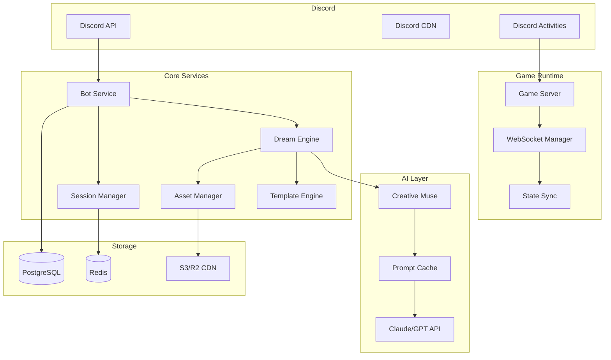

# Discord Game Creator Bot: A "Vibe Coding" Implementation Plan 

This refined plan transforms the original technical blueprint into a guide for creating a "vibe-driven" game creation experience on Discord. The focus is on intuitive, AI-powered, and social game-making that feels more like a creative jam session than a software engineering project. 

## 1. System Architecture: The "Vibe" Engine 

### High-Level Architecture 

The core components are renamed to reflect their creative purpose. The "Game Generator" becomes the **"Dream Engine,"** and the "LLM Orchestrator" is now the **"Creative Muse."** This sets the tone for a more imaginative and less technical user experience. 



### Tech Stack Decisions 

The chosen technologies are perfect for rapid, scalable development, which is key to the "vibe coding" philosophy. This stack lets developers focus on the creative experience, not the infrastructure. 

```yaml
Core:
  Language: TypeScript 5.0+ # For robust, scalable code.
  Runtime: Node.js 20 LTS # Modern, fast, and reliable.
  Package Manager: pnpm (for monorepo) # Efficiently manages our multi-package structure.

Discord:
  Bot Framework: Discord.js v14 # The standard for building powerful Discord bots.
  Activities: Discord Embedded App SDK # Crucial for running games directly within Discord. [31, 32]
  Voice: @discordjs/voice # For innovative voice-controlled game mechanics.

Backend:
  API Framework: Fastify # Chosen for its speed, ensuring snappy, real-time interactions.
  WebSocket: Socket.io # For real-time communication in multiplayer games.
  Queue: BullMQ # Manages the game generation queue, preventing bottlenecks.
  ORM: Prisma 5 # Modern, type-safe database access.
  Validation: Zod # For robust and clear data validation.

AI/LLM:
  Primary: Anthropic Claude 3 Haiku # Fast and cost-effective, ideal for near-instant responses. [19]
  Fallback: OpenAI GPT-3.5-turbo # A reliable alternative for code generation.
  Embeddings: OpenAI Ada-2 # For semantic caching and finding similar "vibes."

Game Engine:
  2D Framework: Phaser 3.70 # A powerful and flexible framework for web-based games.
  Physics: Matter.js # For realistic physics in our generated games.
  Multiplayer: Colyseus # A battle-tested framework for multiplayer game servers. [8, 20]

Infrastructure:
  Hosting: Railway # "Just works" deployment, perfect for focusing on creative features. [9, 17]
  Database: Neon # Serverless Postgres that scales with our needs.
  Cache: Upstash Redis # For lightning-fast caching of prompts and game data. [3, 25]
  CDN: Cloudflare R2 # For globally distributed and fast asset delivery.
``` 

## 2. Project Structure: Organized for Creativity 

The project is organized into distinct packages within a monorepo, allowing for clear separation of concerns and easier collaboration. Key packages include the `bot`, the `dream-engine` for game generation, and the `web-runtime` for the in-Discord game client. 

```bash
vibe-creator-bot/
├── packages/
│   ├── bot/                 # The heart of our Discord bot.
│   ├── dream-engine/        # The AI-powered game generation engine.
│   ├── shared/              # Shared code and types between packages.
│   ├── web-runtime/         # The client that runs the game inside Discord.
│   └── muse-service/        # Handles all interactions with the AI.
├── infrastructure/          # Deployment configurations (Docker, etc.).
├── scripts/                 # Utility scripts for building and deploying.
└── ...
``` 

## 3. Database Schema: Storing the "Vibes" 

The database schema is designed to not only store user and game data but also to capture the creative essence of each creation. 

```sql
-- Games table
CREATE TABLE games (
    id UUID PRIMARY KEY DEFAULT gen_random_uuid(),
    short_id VARCHAR(8) UNIQUE NOT NULL, -- For easy sharing
    server_id UUID REFERENCES servers(id),
    creator_id UUID REFERENCES users(id),
    name VARCHAR(100) NOT NULL,
    description TEXT,
    vibe_prompt TEXT, -- The original user prompt that sparked the game.
    tags JSONB DEFAULT '[]', -- AI-generated tags to capture the "vibe".
    type VARCHAR(50) NOT NULL,
    template_id VARCHAR(50),
    code TEXT NOT NULL, -- The compiled game code.
    assets JSONB DEFAULT '{}',
    play_count INTEGER DEFAULT 0,
    remix_count INTEGER DEFAULT 0,
    is_public BOOLEAN DEFAULT true,
    created_at TIMESTAMP DEFAULT NOW(),
    updated_at TIMESTAMP DEFAULT NOW()
);

-- Other tables (users, servers, game_sessions, etc.) remain as planned.
```

## 4. Core Implementation: Bringing Ideas to Life 

### Game Creation: From `/vibe` to Playable Game 

The primary user interaction is the `/vibe` command, designed to be open-ended and intuitive. 

```typescript
// packages/bot/src/commands/vibe.ts
import { SlashCommandBuilder, CommandInteraction, ModalBuilder, ... } from 'discord.js';

// The command that kicks off the creative process.
data = new SlashCommandBuilder()
    .setName('vibe')
    .setDescription('Dream up a game with a vibe, a description, or an idea.')
    .addStringOption(option =>
        option.setName('prompt')
            .setDescription('Describe your game\'s vibe: "a chill platformer with a cat collecting stars"')
            .setRequired(true)
    );

async execute(interaction: CommandInteraction) {
    const prompt = interaction.options.getString('prompt');
    
    await interaction.deferReply(); // Acknowledge the user while the AI works its magic.

    try {
        // The Dream Engine generates the game based on the user's vibe.
        const game = await this.dreamEngine.generateFromVibe({
            prompt,
            serverId: interaction.guildId!,
            userId: interaction.user.id,
        });
        
        // Respond with an embed and a "Play Now" button.
        await interaction.editReply({ embeds: [createGameEmbed(game)] });

    } catch (error) {
        // Handle errors gracefully.
        await interaction.editReply({ content: '❌ The vibe was too powerful! Please try again.' });
    }
}
```

### The Dream Engine: Interpreting the Vibe 

The `DreamEngine` service is where the magic happens. It uses AI to translate a user's prompt into a fully functional game. 

```typescript
// packages/dream-engine/src/dream-engine.service.ts
import { AIService } from '@vibe-creator/muse-service';

// Analyzes the user's prompt to understand the core concept and feeling.
private async analyzeVibe(prompt: string): Promise<GameSpec> {
    const analysis = await this.ai.analyze({
        prompt: `You are a creative game designer. Analyze this game prompt and extract the core vibe, mechanics, and aesthetic.
        
        Prompt: "${prompt}"

        Extract:
        1.  A catchy game name.
        2.  The primary game genre (e.g., platformer, puzzle, RPG).
        3.  The core "vibe" or feeling (e.g., chill, chaotic, mysterious).
        4.  Key gameplay mechanics.
        5.  A list of descriptive tags.

        Output as a clean JSON object.`,
        model: 'claude-3-haiku' // Fast and creative. [19]
    });
    
    return JSON.parse(analysis);
}

// Generates the game code based on the analyzed vibe and a suitable template.
private async generateGameCode(spec: GameSpec, template: GameTemplate): Promise<string> {
    const prompt = `You are an expert Phaser game developer. Generate a complete, playable game based on the following vibe.
    
    Vibe: ${spec.vibe}
    Genre: ${spec.genre}
    Description: ${spec.description}
    Mechanics: ${spec.mechanics.join(', ')}

    Use the provided template structure. Make the game fun, juicy, and immediately playable.
    
    Template:
    ${template.structure}
    
    Generate ONLY the runnable game code.`;
    
    // The AI generates the code, which is then validated and sandboxed.
    const code = await this.ai.generate(prompt);
    return code;
}```

### AI Prompt Engineering: The Art of Instruction 

The quality of the generated games depends heavily on the prompts sent to the AI. This is a critical area of focus, involving crafting detailed instructions that guide the AI to produce creative and functional code. 

## 5. Discord Activity Integration: Seamless Play 

The game itself runs in an iframe within Discord, using the Embedded App SDK to create a seamless social experience. 

```typescript
// packages/web-runtime/src/discord-activity.ts
import { DiscordSDK } from '@discord/embedded-app-sdk';

// This class manages the game's interaction with the Discord client.
export class DiscordGameActivity {
    private discordSdk: DiscordSDK;
    
    async initialize() {
        // Authenticate with Discord.
        await this.discordSdk.ready();
        
        // Get user info to personalize the game.
        const { user } = this.discordSdk;
        
        // Fetch the game code and assets.
        const gameData = await this.loadGameData(this.discordSdk.instanceId);
        
        // Set the user's activity status in Discord.
        this.discordSdk.activity.setActivity({
            details: `Vibing in: ${gameData.name}`,
            state: 'Creating and playing together!',
        });
        
        // Load and run the Phaser game.
        this.createGame(gameData);
    }
}
```

## 6. Performance and Scalability 

### Caching Strategies 

A multi-layered caching strategy using Upstash Redis and in-memory LRU caches is essential for performance. This reduces latency and API costs by caching everything from AI-generated code to user profiles. Semantic caching can also be used to find similar prompts and return cached results, making the experience feel instantaneous. 

### Infrastructure 

The choice of Railway for hosting and Neon for the database provides a serverless, scalable foundation that can handle fluctuating loads without manual intervention. This is ideal for a project that could experience rapid growth. 

## Conclusion 

This "vibe-driven" approach transforms a technical project into a creative tool that empowers Discord users to bring their game ideas to life. By focusing on an intuitive user experience, leveraging the power of AI for code generation, and building on a robust and scalable tech stack, the Discord Game Creator Bot can become a vibrant platform for social creativity and play.